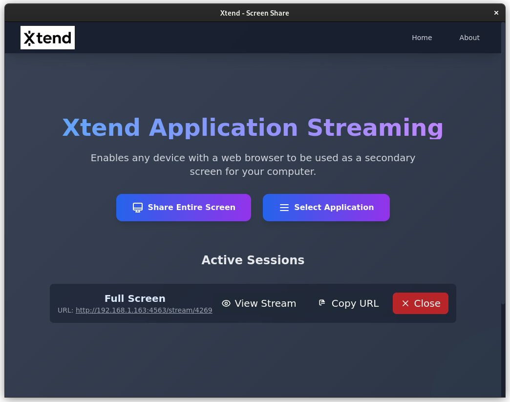

# Xtend

**Extend your monitor through your browser.**

Xtend lets you stream application windows over a local web server, so you can use phones, tablets, or other PCs as extra displays — no cables, no extra apps, just your browser.

Github: [https://github.com/itsmepvr/Xtend](https://github.com/itsmepvr/Xtend)

---

## 🚀 Features

- Extend your desktop across devices via a local web server
- Real-time streaming with low latency
- Cross-platform: Linux (X11/Composite) & macOS (PyObjC)
- Qt-based GUI and REST API support
- Simple setup and installation

---

## 📦 Installation

```
git clone https://github.com/itsmepvr/Xtend.git
cd Xtend
pip install -r requirements.txt
pip install -e .
xtend
```

---

## 🔗 Download

👉 [Download the latest release](https://github.com/itsmepvr/Xtend/releases/latest)

---

## 📸 Screenshots



---

## ⚙️ Requirements

- Python 3.11+
- FastAPI, Uvicorn
- X11 Composite extensions (Linux) / PyObjC (macOS)

---

## 💡 Contributing

Contributions are welcome!

- Fork the [repo](https://github.com/itsmepvr/Xtend) 
- Create a feature branch
- Submit a pull request

---

## 📜 License

Xtend is released under the MIT License.

## Author

Developed by [Venkata Ramana, P](https://itsmepvr.is-a.dev).

- [https://itsmepvr.is-a.dev](https://itsmepvr.is-a.dev)
